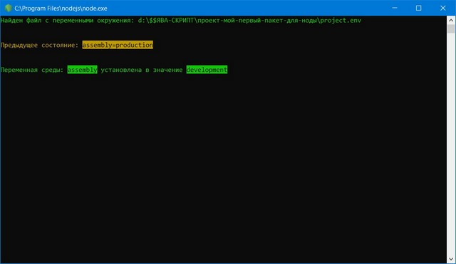
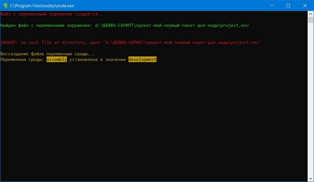

# Переключатель режимов сборки через переменные среды

Это вспомогательный скрипт, который планируется устанавливать как модуль в проект
со сборщиком [Webpack](https://webpack.js.org/). Подразумевается, что скрипт
будет автоматически находить файл с переменными среды и соответственно менять
содержимое ключа assembly на 'development' или 'production'. При необходимости
он будет создавать файл или ключ с нуля.

## Приступить к работе

~~Поскольку развертывание еще не произведено, этот пункт пока не заполнен.~~

### Зависимости

Для более наглядного состояния работы скрипта используется пакет [colors](https://github.com/Marak/colors.js), который
раскрашивает командную строку.<br>


При `успешной работе` командная строка будет иметь такой вид:<br><br>
<br><br>
Если `что-то пошло не так`, то вид будет такой:<br><br>
![командная строка раскрашена красным]<br><br>


### Installing

A step by step series of examples that tell you how to get a development env running

Say what the step will be

```
Give the example
```

And repeat

```
until finished
```

End with an example of getting some data out of the system or using it for a little demo

## Тестирование

Тестирование проводилось вручную, были испытаны следующие комбинации:
В рабочем каталоге находилось более одного файла с расширением .env
В рабочем каталоге не было ни одного файла с расширением .env
Файл .env был защищен от записи
В файле .env было постороннее содержимое

### Break down into end to end tests

Explain what these tests test and why

```
Give an example
```

### And coding style tests

Explain what these tests test and why

```
Give an example
```

## Deployment

Add additional notes about how to deploy this on a live system

## Built With

* [Dropwizard](http://www.dropwizard.io/1.0.2/docs/) - The web framework used
* [Maven](https://maven.apache.org/) - Dependency Management
* [ROME](https://rometools.github.io/rome/) - Used to generate RSS Feeds

## Contributing

Please read [CONTRIBUTING.md](https://gist.github.com/PurpleBooth/b24679402957c63ec426) for details on our code of conduct, and the process for submitting pull requests to us.

## Versioning

We use [SemVer](http://semver.org/) for versioning. For the versions available, see the [tags on this repository](https://github.com/your/project/tags).

## Authors

* **Billie Thompson** - *Initial work* - [PurpleBooth](https://github.com/PurpleBooth)

See also the list of [contributors](https://github.com/your/project/contributors) who participated in this project.

## License

This project is licensed under the MIT License - see the [LICENSE.md](LICENSE.md) file for details

<!---
## Acknowledgments

* Hat tip to anyone whose code was used
* Inspiration
* etc
-->
